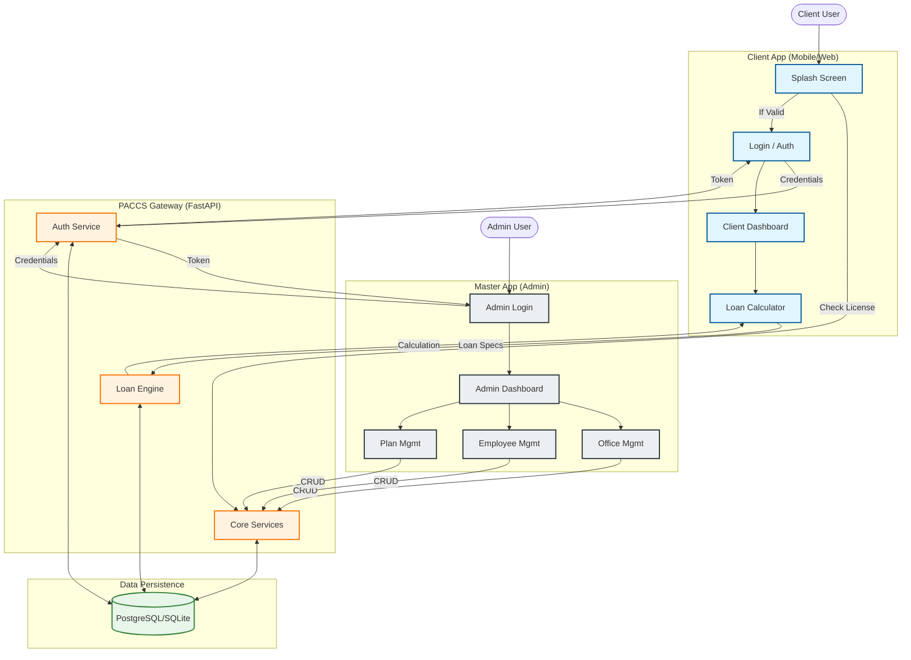
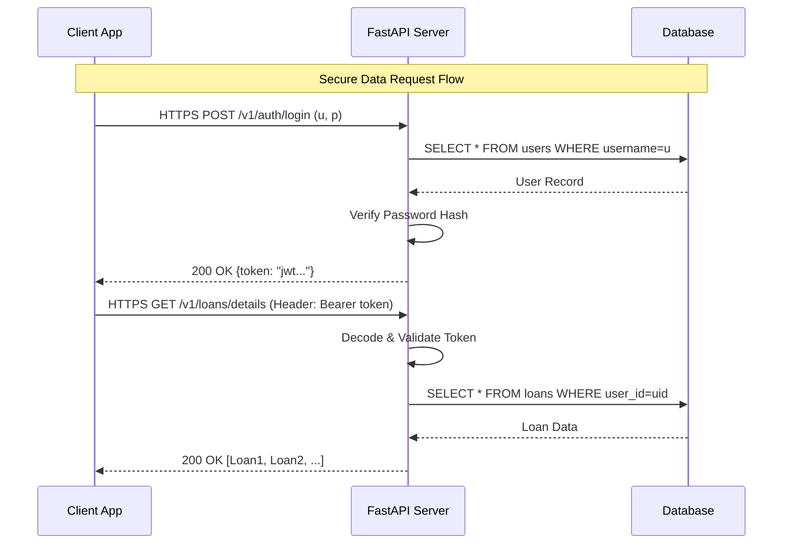

# PACCS Master Project Flow Chart

This document visualizes the complete end-to-end flow of the PACCS ecosystem, from User Interaction to Database Persistence.

```mermaid
graph TD
    %% Nodes
    User_Client([Client User])
    User_Admin([Admin User])
    
    subgraph "Client App (Mobile/Web)"
        SplScreen[Splash Screen]
        Auth_Client[Login / Auth]
        Dashboard_Client[Client Dashboard]
        Loan_Calc[Loan Calculator]
    end
    
    subgraph "Master App (Admin)"
        Auth_Admin[Admin Login]
        Dashboard_Admin[Admin Dashboard]
        Mgmt_Office[Office Mgmt]
        Mgmt_Emp[Employee Mgmt]
        Mgmt_Plan[Plan Mgmt]
    end
    
    subgraph "PACCS Gateway (FastAPI)"
        API_Auth[Auth Service]
        API_Core[Core Services]
        API_Loan[Loan Engine]
    end
    
    subgraph "Data Persistence"
        DB[(PostgreSQL/SQLite)]
    end

    %% Client Flow
    User_Client --> SplScreen
    SplScreen -->|Check License| API_Core
    SplScreen -->|If Valid| Auth_Client
    Auth_Client -->|Credentials| API_Auth
    API_Auth -->|Token| Auth_Client
    Auth_Client --> Dashboard_Client
    Dashboard_Client --> Loan_Calc
    Loan_Calc -->|Loan Specs| API_Loan
    API_Loan -->|Calculation| Loan_Calc

    %% Admin Flow
    User_Admin --> Auth_Admin
    Auth_Admin -->|Credentials| API_Auth
    API_Auth -->|Token| Auth_Admin
    Auth_Admin --> Dashboard_Admin
    
    Dashboard_Admin --> Mgmt_Office
    Dashboard_Admin --> Mgmt_Emp
    Dashboard_Admin --> Mgmt_Plan
    
    Mgmt_Office -->|CRUD| API_Core
    Mgmt_Emp -->|CRUD| API_Core
    Mgmt_Plan -->|CRUD| API_Core

    %% Backend Flow
    API_Auth <--> DB
    API_Core <--> DB
    API_Loan <--> DB

    %% Styling
    classDef mobile fill:#e1f5fe,stroke:#01579b,stroke-width:2px;
    classDef admin fill:#eceff1,stroke:#263238,stroke-width:2px;
    classDef server fill:#fff3e0,stroke:#ff6f00,stroke-width:2px;
    classDef db fill:#e8f5e9,stroke:#2e7d32,stroke-width:2px;

    class SplScreen,Auth_Client,Dashboard_Client,Loan_Calc mobile;
    class Auth_Admin,Dashboard_Admin,Mgmt_Office,Mgmt_Emp,Mgmt_Plan admin;
    class API_Auth,API_Core,API_Loan server;
    class DB db;
```

## Detailed Request Lifecycle

```mermaid
sequenceDiagram
    participant C as Client App
    participant S as FastAPI Server
    participant D as Database

    Note over C, D: Secure Data Request Flow

    C->>S: HTTPS POST /v1/auth/login (u, p)
    S->>D: SELECT * FROM users WHERE username=u
    D-->>S: User Record
    S->>S: Verify Password Hash
    S-->>C: 200 OK {token: "jwt..."}

    C->>S: HTTPS GET /v1/loans/details (Header: Bearer token)
    S->>S: Decode & Validate Token
    S->>D: SELECT * FROM loans WHERE user_id=uid
    D-->>S: Loan Data
    S-->>C: 200 OK [Loan1, Loan2, ...]
```
