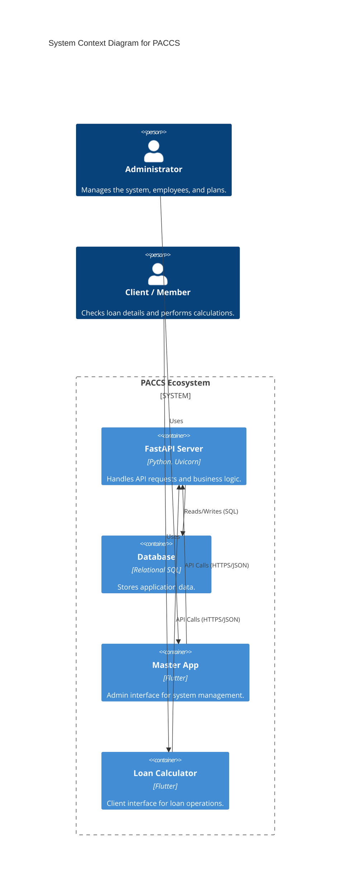
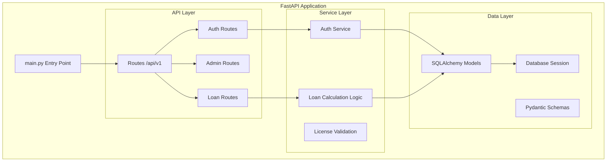
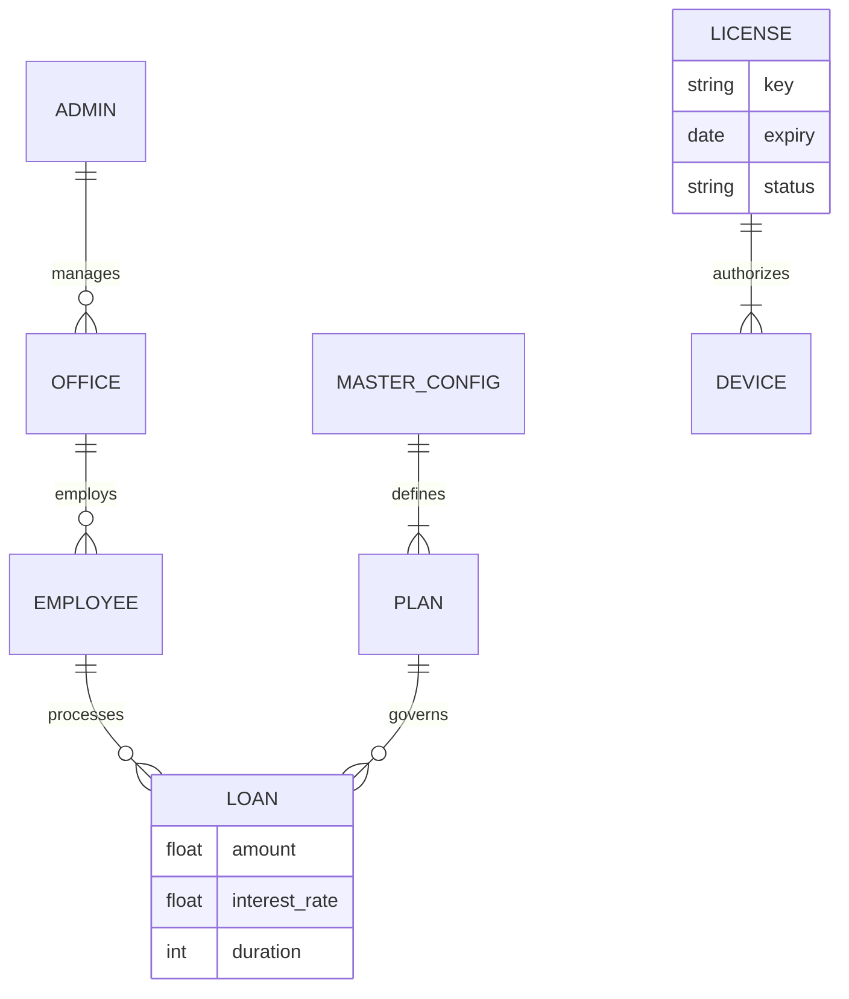

# System Design & Diagrams

## Container Diagram

This diagram visualizes the high-level containers that make up the software architecture.

## Component Diagram (Backend)

Architecture of the FastAPI Server `app` folder.

## Entity Relationship Diagram (ERD) - Conceptual

Abstracted view of the data model based on codebase analysis.

